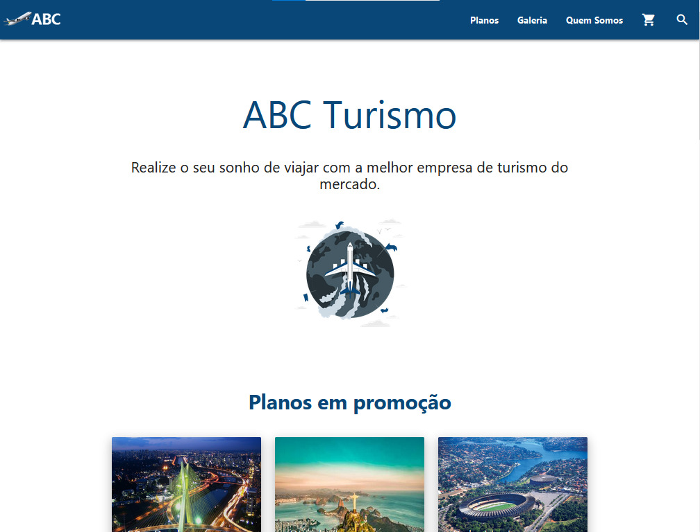
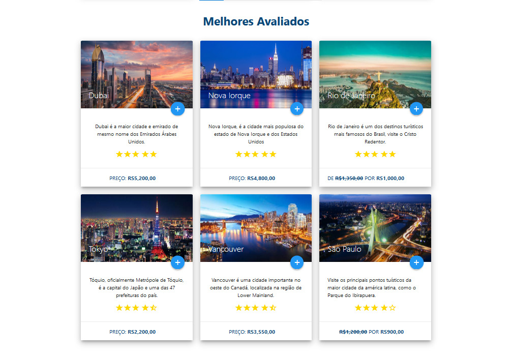

# ✈️ **ABC Turismo** - Agência de Passagens Aéreas

[Visite o Site](https://marcosguisleri.github.io/ABC-Turismo-generic/)

**ABC Turismo** é um projeto simples de front-end, criado como parte do meu **processo de formação técnica**. Este foi **meu primeiro contato com o Materialize CSS**, onde tive a oportunidade de explorar as funcionalidades e conceitos desse framework, além de aplicar os conhecimentos de **HTML** e **CSS** adquiridos.

O projeto representa uma **agência fictícia de passagens aéreas** e foi desenvolvido como uma maneira de testar o uso do **Materialize CSS** e aprimorar minhas habilidades em desenvolvimento web.

Embora o design seja simples e um pouco datado, o objetivo principal foi aprender a criar layouts responsivos e utilizar o framework de maneira eficaz.

## 🚀 Funcionalidades

- **Layout Responsivo**: Utilizando o **Materialize CSS**, o site se adapta a diferentes tamanhos de tela e oferece uma experiência de navegação fluída.
- **Estrutura Básica**: A página inicial contém elementos básicos como menu e rodapé, com a estruturação simples de uma página web.

## 🛠 Tecnologias Utilizadas

- **HTML**: Para a construção da estrutura da página.
- **CSS**: Para estilizar os elementos e garantir um design visual.
- **Materialize CSS**: Framework utilizado para implementar o **Material Design** e um layout responsivo.

## 📸 Imagem do Projeto





---

## 🚀 Como Rodar o Projeto Localmente

1. Clone o repositório:

   ```bash
   git clone https://github.com/seuusuario/ABC-Turismo-generic.git

---

## 📅 Licença

Este projeto foi desenvolvido como um exercício pessoal durante o meu processo de aprendizado e não tem fins comerciais. Todos os direitos reservados ao desenvolvedor.


